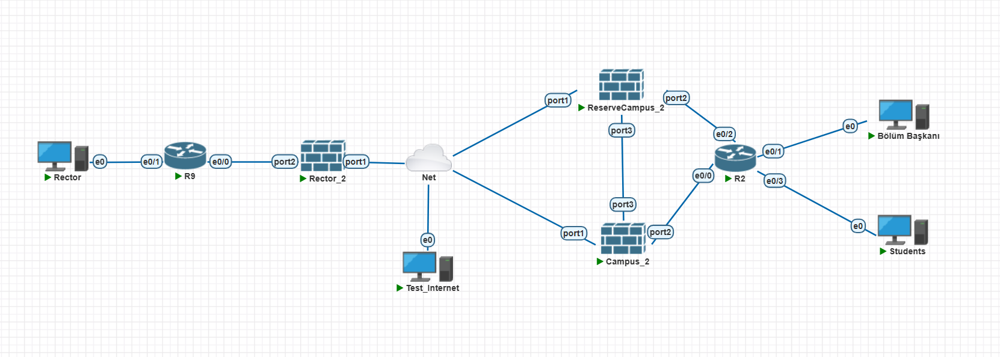
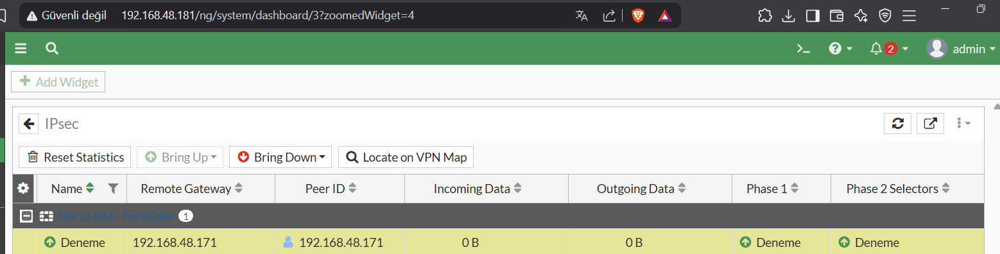

# 🛡️ FortiGate Campus Network Security Simulation (PNETLab)



This repository contains the completed **FortiGate-based campus network security project**. All configurations, topologies, and tests have been successfully implemented.

The project demonstrates VLAN segmentation, inter-VLAN routing, firewall policies, NAT, DHCP, VPN, UTM profiles, logging & monitoring, and High Availability (HA) setup.

---

## 📂 Project Structure

```
FortiGate-Campus-Project/
├── README.md
├── Topology/
│   └── Project_Campus.unl        (PNETLab/EVE-NG topology file)
└── Configs/
    ├── Campus_Active.conf        (Campus FortiGate Active configuration)
    ├── Reserve_Campus_Passive.conf (Campus FortiGate HA backup configuration)
    └── Rector_Branch.conf        (Rector/Branch FortiGate configuration)
```

- **Topology/**: Contains the PNETLab/EVE-NG topology file  
- **Configs/**: Contains all FortiGate configuration files for Campus and Rector/Branch firewalls  

---

## ⚙️ Implemented Features

- **VLANs & Subinterfaces:** Admin, Finance, and Students networks segmented  
- **Firewall Policies & Zones:** Inter-VLAN access control rules applied  
- **NAT & VIP:** Outbound NAT configured for internet access  
- **DHCP Server:** Students VLAN dynamically assigns IP addresses  
- **VPNs:** IPSec Site-to-Site VPN between Campus and Rector/Branch  
- **UTM Security Profiles:** Web Filtering, Application Control, IPS  
- **Logging & Monitoring:** Local logs enabled, policy hit counts monitored  
- **High Availability (HA):** Active-Passive configuration between Campus FortiGates  

---

## 🌐 Network Topology Overview

### 1. ⚙️ Central Area
- **Rector PC → R9 router, e0 port**  
- `R9` → `Rector_2` firewall traffic routing  
- `Rector_2` → Internet (Net)  
- **Test_Internet PC** directly connected to Net for testing  

### 2. 🛡️ Campus Area (HA)

  
*Campus firewall in Primary/Active role*

  
*Reserve Campus firewall active as primary for testing failover*

- **Internet Connection:** Both firewalls connected to Net  
- **HA Link:** port3 between firewalls for failover and heartbeat  
- **Connection to R2 Router:**  
  - Campus_2 → port2 → R2 e0/0  
  - ReserveCampus_2 → port2 → R2 e0/2  

### 3. 🖥️ Local Campus LAN
- `R2` router distributes traffic to end devices  
- **Connected devices:**  
  - Department Head PC → R2 e0/1  
  - Students PC → R2 e0/3  

> The topology ensures secure and continuous distribution of internet traffic from the central area to campus end users.

---

## 🔗 VPN & Traffic Monitoring

  
*IPSec VPN is active and fully operational*

  
*Web filter in action monitoring outbound traffic*

---

## 🔍 Notes

- All configurations implemented via CLI and verified through GUI  
- HA and VPN setups fully operational and tested  
- VLAN, NAT, DHCP, and policy rules functioning as expected  

---

## 🎯 Key Learning Outcomes

- VLAN & inter-VLAN routing experience  
- Firewall policy & NAT management  
- DHCP & zone configuration  
- VPN & UTM configuration experience  
- Logging, monitoring & debugging skills  
- HA setup and failover management  

---

# 🛡️ FortiGate Temelli Kampüs Ağı Güvenlik Simülasyonu (PNETLab)


Bu repository, tamamlanmış **FortiGate tabanlı kampüs ağı güvenlik projesini** içermektedir. Tüm konfigürasyonlar, topolojiler ve testler başarıyla uygulanmıştır.

Proje, VLAN segmentasyonu, inter-VLAN routing, firewall policyleri, NAT, DHCP, VPN, UTM profilleri, loglama & monitoring ve High Availability (HA) yapılandırmasını göstermektedir.

---

## 📂 Proje Yapısı

```
FortiGate-Campus-Project/
├── README.md
├── Topology/
│   └── Project_Campus.unl        (PNETLab/EVE-NG topoloji dosyası)
└── Configs/
    ├── Campus_Active.conf        (Campus FortiGate Aktif konfigürasyonu)
    ├── Reserve_Campus_Passive.conf (Campus FortiGate HA Yedek konfigürasyonu)
    └── Rector_Branch.conf        (Rektör/Şube FortiGate konfigürasyonu)
```

- **Topology/**: PNETLab/EVE-NG topoloji dosyasını içerir  
- **Configs/**: Campus ve Rektör/Şube FortiGate konfigürasyon dosyalarını içerir  

---

## ⚙️ Uygulanan Özellikler

- **VLAN & Alt-Interface:** Admin, Finance ve Students ağları segment edildi  
- **Firewall Policy & Zone:** Inter-VLAN erişim kuralları uygulandı  
- **NAT & VIP:** İnternet erişimi için outbound NAT yapılandırıldı  
- **DHCP Server:** Students VLAN IP atamalarını dinamik olarak dağıtır  
- **VPN:** Campus ve Rektör/Şube arasında IPSec Site-to-Site VPN  
- **UTM Güvenlik Profilleri:** Web Filtering, Application Control, IPS  
- **Loglama & Monitoring:** Local log aktif, policy hit count izlendi  
- **High Availability (HA):** Campus FortiGate’leri arasında Active-Passive HA yapılandırması  

---

## 🌐 Ağ Topolojisi Özeti

### 1. ⚙️ Merkezi Alan
- **Rektör PC → R9 yönlendirici, e0 port**  
- `R9` → `Rector_2` firewall trafiğini yönlendirir  
- `Rector_2` → İnternet (Net)  
- **Test_Internet PC** doğrudan Net’e bağlı  

### 2. 🛡️ Kampüs Bölgesi (HA)

  
*Campus firewall aktif, primary rolünde*

  
*Reserve Campus firewall failover testi için primary konumunda aktif*

- **Net Bağlantısı:** Her iki firewall Net’e bağlı  
- **HA Yedeklilik Bağlantısı:** port3 üzerinden failover ve heartbeat için  
- **R2 Yönlendiriciye Bağlantı:**  
  - Campus_2 → port2 → R2 e0/0  
  - ReserveCampus_2 → port2 → R2 e0/2  

### 3. 🖥️ Yerel Kampüs Ağı
- `R2` yönlendiricisi trafiği son kullanıcılara dağıtır  
- **Bağlı cihazlar:**  
  - Bölüm Başkanı PC → R2 e0/1  
  - Students PC → R2 e0/3  

> Topoloji, merkezden gelen internet trafiğini kampüs kullanıcılarına güvenli ve kesintisiz dağıtır.

---

## 🔗 VPN & Trafik İzleme

  
*IPSec VPN aktif ve tam çalışır durumda*

  
*Web filter trafiği izlerken çalışıyor*

---

## 🔍 Notlar

- Tüm konfigürasyonlar CLI ile yapılmış ve GUI üzerinden doğrulanmıştır  
- HA ve VPN konfigürasyonları tam çalışır durumda  
- VLAN, NAT, DHCP ve policy kuralları beklenen şekilde çalışmaktadır  

---

## 🎯 Kazanımlar

- VLAN ve inter-VLAN routing deneyimi  
- Policy ve NAT yönetimi  
- DHCP ve zone kullanımı  
- VPN ve UTM konfigürasyonu deneyimi  
- Loglama, monitoring ve debug yetkinliği  
- HA kurulum ve failover yönetimi  

---

## 🖊️ Projeyi Hazırlayan

---

<h2 align="center">HÜSEYİN CAN YILMAZ</h2>
<p align="center">
Completed this project during internship at <strong>Turkcell – Data & Security Customer Operations Department</strong><br>
FortiGate Campus Network Security Simulation (PNETLab)
</p>

---

